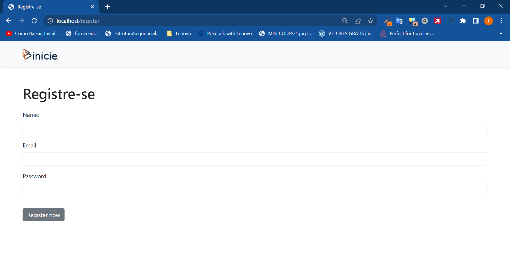

<p align="center"><a href="https://laravel.com" target="_blank"></a></p>

<hr>

<h1 align="center">API REST</h1>
<br>

<h3 align="center">Este é um projeto que tem como objetivo testar minhas habilidades utilizando o framework Laravel, onde foi proposto pela empresa Inicie Educação fazer o consumo completo de uma API fornecida por eles.</h3>
<br>
<h3 align="center">Neste projeto quis mostrar não só o que o posso fazer com o framework, mas também o que posso fazer sem utilizar ele, ou seja com PHP puro, sendo algumas coisas feitas "na unha" mesmo para demostrar meu conhecimento na linguagem em si.</h3>
<br>
<hr>
<br>
<h1 align="center">Exigências do projeto</h1>
<ul>
    <h3>Exigências</h3>
    <li>Criar um novo usuário dentro do sistema</li>
    <li>Listar todos os usuários da API e encontrar o usuário criado através do ID do mesmo (o ID será retornado na operação de criação)</li>
    <li>Criar um novo post para o usuário criado</li>
    <li>Criar um novo comentário dentro do post criado</li>
    <li>Criar um novo comentário dentro do primeiro post da lista pública de posts</li>
    <li>Apagar o comentário criado no requisito acima</li>
    <li>Disponibilizar o projeto em um repositório do Git com as instruções para que a equipe de avaliação consiga executar</li>
</ul>

<br>
<hr>
<br>
<h1 align="center">Algumas imagens do projeto</h1>
<br>

<hr>

<hr>

<hr>

<hr>

<hr>

<hr>

<hr>

<hr>

<hr>
<br>

<h1 align="center">Utilizando o projeto</h1>

<div align="center">


</div>
<br>
<br>
<br>

<ul>
    <li>PHP 8.1.2</li>
    <li>Ubuntu 20.11</li>
    <li>Laravel 10</li>
    <li>Docker Desktop 4.18.0 </li>
</ul>
<br>

## Primeiramente clone o projeto para seu ambiente de desenvolvimento desta forma:
<br>

```
git clone https://github.com/thiagodevmaster/ApiRepositoryInicie.git
```
<br>

## Logo em seguida execute o comando:
### para poder resolver e instalar todas as dependências do projeto
<br>

```
composer install
```
<br>

## # Antes de iniciar o projeto é necessário inserir sua chave de autenticação para acessar a API. Crie na pasta do projeto um arquivo chamado .env . Em seguida vá no arquivo chamado .env-example, copie todo o conteúdo do arquivo e cole no arquivo criado chamado .env
<br>

## Em seguida insira sua chave de acesso na constante chamada ( API_KEY ) .
<br>
<hr>

<br>

## Este projeto utiliza o sail do Laravel para rodar em um ambiente docker, então pode-se utilizar o comando no seu terminal:
<br>

```
alias sail='[ -f sail ] && sh sail || sh vendor/bin/sail'

sail up
``` 

<br>

## isso subirá os serviços necessários utilizados pelo arquivo ( docker-compose.yml ) para o projeto funcionar corretamente.

<br>
<hr>
<br>

## Também podem ser feitos testes com a utilização do PHP Unit rodando simplesmente o seguinte código no terminal:
<br>

```
sail php artisan test

ou

php artisan test
```
<br>

## Isto gera um arquivo chamado ( Testes-Executados.txt ), localizado na pasta raiz do projeto.

<br>
<hr>
<br>

## Utilizando um banco de dados simples, no nosso caso o SQLite3 temos um usuário já criado para acessar o sistema:
<br>

### Email: <strong>admin@admin.com</strong>
### Senha: <strong>admin</strong>
<br>

## Então é só abrir o browser e digitar localhost que você será redirecionado para a área de login. Após efetuar o login, você terá acesso ao sistema do forma que poderá: 

<ul>
    <li><strong>visualizar a lista de clientes contidos na api</strong></li>
    <li><strong>Criar clientes dentro da api</strong></li>
    <li><strong>Editar clientes dentro da api</strong></li>
    <li><strong>Deletar clientes dentro da api</strong></li>
    <li><strong>Criar posts de clientes dentro da api</strong></li>
    <li><strong>Criar comentários dentro de posts de clientes da api</strong></li>
    <li><strong>Deletar comentários dentro de posts de clientes da api</strong></li>
    <li><strong>Recuperar id de clientes criados</strong></li>
    <li><strong>Fazer logout do sistema</strong></li>

</ul>

<br>

## Qualquer dúvida e entrar em contato:

<h3>Email: <strong>thiagodantas.dev@gmail.com</strong></h3>


